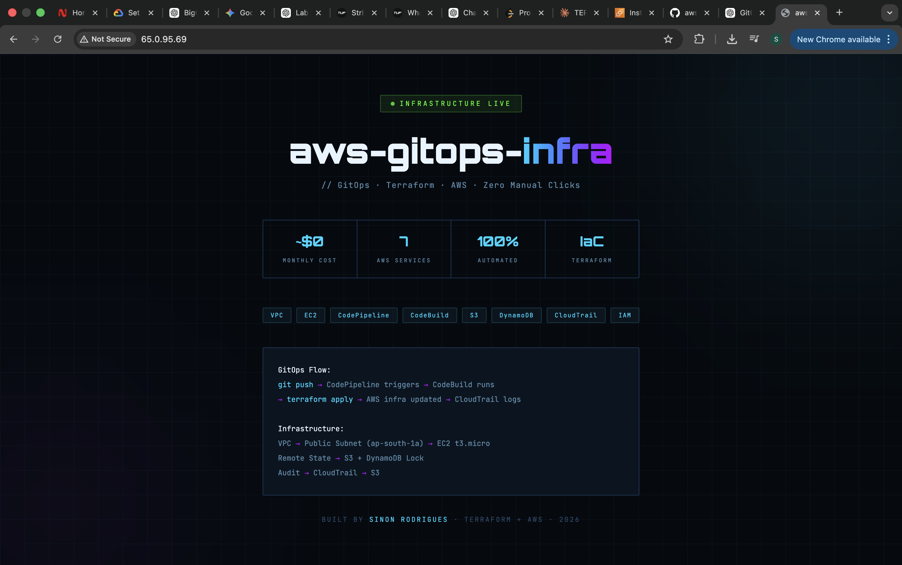

# 🚀 aws-gitops-infra

> Production-grade GitOps infrastructure automation using Terraform + AWS CodePipeline.
> Every Git push automatically provisions real AWS infrastructure — zero manual clicks.

**🔴 LIVE DEMO**: [http://65.0.95.69](http://65.0.95.69)

---

## 📸 Live Dashboard



The EC2 instance serves a live dashboard showing the GitOps workflow, infrastructure stats, and architecture details.

---

## 📌 What This Project Does

This project implements a **GitOps workflow** where:
- Infrastructure is defined as code using **Terraform**
- Every `git push` to `main` triggers **AWS CodePipeline**
- CodeBuild runs `terraform plan` + `terraform apply` automatically
- All changes are **audited** via CloudTrail

---

## 🏗️ Architecture

```mermaid
graph TB
    Dev[👨‍💻 Developer] -->|git push| GH[📦 GitHub Repository]
    GH -->|CodeStar Connection| CP[⚙️ CodePipeline]
    CP -->|triggers| CB[🔨 CodeBuild]
    CB -->|terraform apply| AWS[☁️ AWS Resources]
    
    AWS --> VPC[🌐 VPC<br/>10.0.0.0/16]
    VPC --> Subnet[Public Subnet<br/>10.0.1.0/24]
    Subnet --> EC2[💻 EC2 t3.micro<br/>Apache Server<br/>65.0.95.69]
    VPC --> IGW[🌍 Internet Gateway]
    VPC --> SG[🔒 Security Groups<br/>Port 22, 80]
    
    AWS --> S3State[📦 S3 Bucket<br/>Terraform State]
    AWS --> DDB[🔐 DynamoDB<br/>State Lock]
    AWS --> CT[📊 CloudTrail<br/>Audit Logs]
    AWS --> S3CT[📦 S3 Bucket<br/>CloudTrail Logs]
    
    EC2 -->|serves| Web[🌐 Live Dashboard<br/>http://65.0.95.69]
    
    style Dev fill:#4a9eff
    style GH fill:#24292e
    style CP fill:#ff9900
    style CB fill:#ff9900
    style EC2 fill:#ff9900
    style Web fill:#00d084
```



**Flow**: Developer pushes Terraform code → GitHub triggers CodePipeline → CodeBuild runs `terraform apply` → AWS infrastructure updates → CloudTrail logs all changes

---

## ☁️ AWS Services Used

| Service | Purpose |
|---|---|
| VPC | Private network |
| EC2 (t3.micro) | Web server |
| S3 | Terraform remote state + CloudTrail logs |
| DynamoDB | Terraform state locking |
| CodePipeline | GitOps automation |
| CodeBuild | Run terraform plan/apply |
| CloudTrail | Audit every AWS API call |
| IAM | Least-privilege roles |
| CodeStar Connections | GitHub integration |

---

## 🛠️ Tech Stack

- **Terraform** v1.14.6
- **AWS** (ap-south-1 / Mumbai)
- **GitHub** (source of truth)
- **Apache HTTP Server** (on EC2)

---

## 📁 Project Structure
```
aws-gitops-infra/
├── main.tf              # Root module
├── providers.tf         # AWS provider config
├── variables.tf         # Input variables
├── outputs.tf           # Output values
├── backend.tf           # S3 remote state
├── iam.tf               # IAM roles & policies
├── codebuild.tf         # CodeBuild project
├── codepipeline.tf      # CodePipeline config
├── cloudtrail.tf        # Audit trail
├── buildspec.yml        # CodeBuild instructions
└── modules/
    ├── vpc/             # VPC, subnets, IGW, routes
    └── ec2/             # EC2 instance, AMI, user_data
```

---

## 🚀 How to Deploy

### Prerequisites
- AWS CLI configured (`aws configure`)
- Terraform v1.0+ installed
- GitHub account

### Steps
```bash
# Clone the repo
git clone https://github.com/Sinon1310/aws-gitops-infra.git
cd aws-gitops-infra

# Initialize Terraform
terraform init

# Preview changes
terraform plan

# Deploy
terraform apply

# Destroy when done
terraform destroy
```

---

## 🔄 GitOps Workflow
```
1. Make changes to .tf files
2. git add . && git commit -m "your change"
3. git push origin main
4. CodePipeline triggers automatically
5. Terraform applies changes to AWS
6. CloudTrail logs every action
```

---

## 💡 Skills Demonstrated

- Infrastructure as Code (Terraform)
- GitOps workflow
- AWS VPC networking
- CI/CD for infrastructure
- IAM least-privilege design
- Remote state management
- Audit & compliance (CloudTrail)
- Auto Scaling ready architecture

---

## 💰 Cost

~$0/month (AWS Free Tier)

---

## 🧠 Challenges & Solutions

### Challenge 1: CodeBuild Permission Denied
**Problem**: `terraform plan` failed with `AccessDeniedException` when CodeBuild tried to read CodePipeline state  
**Root Cause**: CodeBuild IAM role was missing `codepipeline:*` permissions  
**Solution**: Added `codepipeline:*` to the CodeBuild role in `iam.tf` to allow it to manage the pipeline that manages itself (bootstrap paradox solved!)

### Challenge 2: EC2 User Data Changes Ignored
**Problem**: Updating the dashboard HTML in `user_data` didn't recreate the EC2 instance  
**Root Cause**: Terraform doesn't replace instances by default when `user_data` changes  
**Solution**: Set `user_data_replace_on_change = true` in the EC2 module, or manually force replacement with `terraform apply -replace="module.ec2.aws_instance.main"`

### Challenge 3: State Lock Conflicts
**Problem**: Pipeline occasionally failed with "Error acquiring state lock"  
**Root Cause**: Previous build crashed without releasing the DynamoDB lock  
**Solution**: Manually delete stuck lock entries in the `terraform-state-lock` DynamoDB table

### Challenge 4: Region-Specific Free Tier
**Problem**: `t2.micro` instances are not Free Tier eligible in `ap-south-1`  
**Root Cause**: AWS Free Tier varies by region  
**Solution**: Switched to `t3.micro` which is Free Tier eligible in Mumbai region

---

## 💰 Cost

~$0/month (AWS Free Tier)

---

## 👨‍💻 Built By

**Sinon Rodrigues** — Cloud / DevOps Engineering Portfolio  
[GitHub](https://github.com/Sinon1310)

---

> *"Infrastructure should be boring, automated, and auditable."*